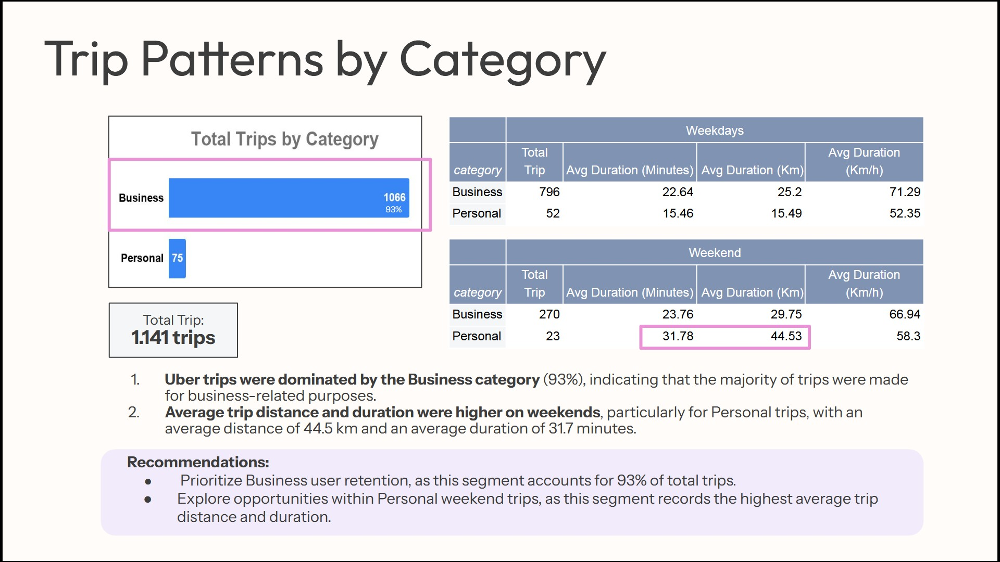
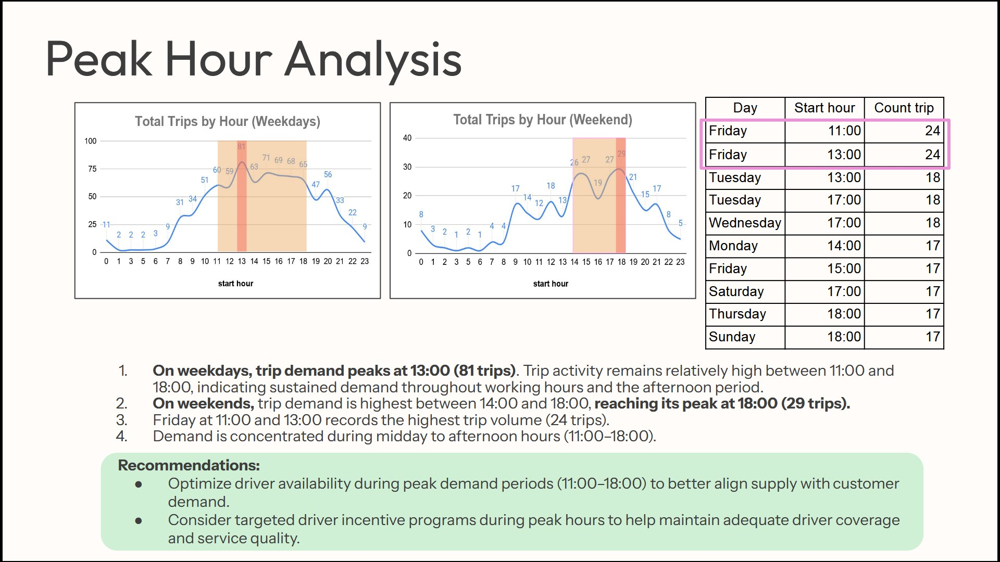
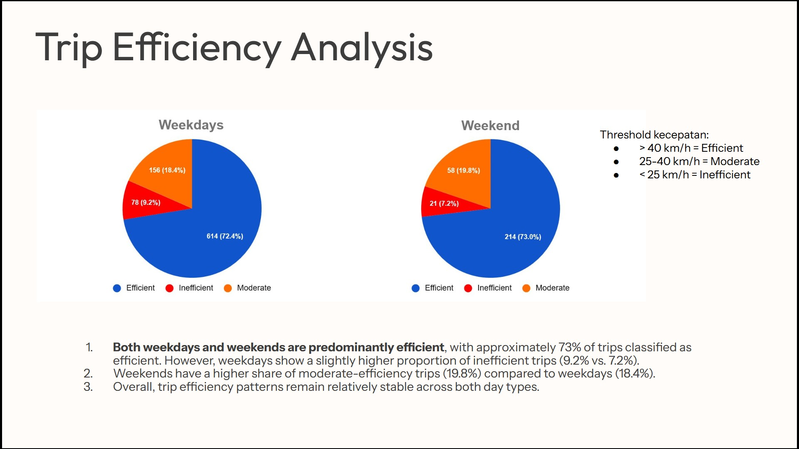
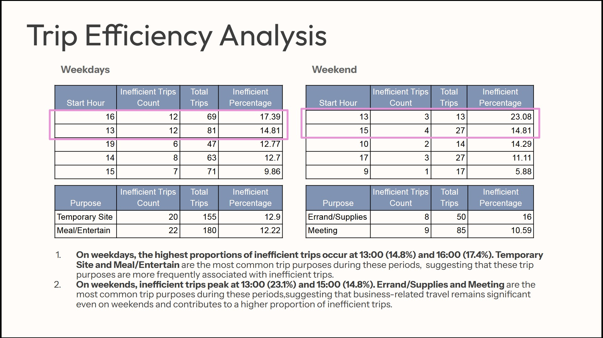

# Uber Trip Analysis

## Project Overview

This project analyzes Uber trip data to understand travel patterns, peak demand periods, and trip efficiency. The analysis was conducted using SQL in Google BigQuery, while visualizations were created in Google Sheets and findings were presented in Google Slides.

## Tools

- Google BigQuery
- Google Sheets
- Google Slides

## Analysis Scope

### 1. Trip Patterns by Category

Analyze travel patterns based on:

- Total trips
- Average trip duration
- Average travel distance

The analysis is segmented by:

- User category (Business and Personal)
- Day type (Weekday and Weekend)

### 2. Peak Hour Analysis

Identify peak demand periods by analyzing:

- Total trips by hour on weekdays and weekends
- Top 10 busiest day-hour combinations

### 3. Trip Efficiency Analysis

Evaluate trip efficiency using average speed (km/h).

Speed classification:

- Efficient: > 40 km/h
- Moderate: 25–40 km/h
- Inefficient: < 25 km/h

The analysis includes:

- Number of efficient, moderate, and inefficient trips
- Hours with the highest proportion of inefficient trips
- Trip purposes with the highest proportion of inefficient trips

## Project Preview

## Key Findings

- Business trips accounted for approximately **93%** of total trips, indicating that business travel was the primary demand driver.
- Personal trips on weekends recorded the highest average trip distance and duration.
- Peak demand was concentrated between **11:00 AM and 6:00 PM**, with weekday demand peaking at **1:00 PM**.
- Approximately **73%** of trips were classified as efficient, indicating generally stable trip efficiency.

## Business Recommendations
- **Prioritize Business user retention**, as this segment accounts for approximately 93% of total trips and represents the primary source of demand.
- **Explore opportunities within Personal weekend trips**, as this segment records the highest average trip distance and duration, indicating potential for targeted service offerings.
- **Optimize driver availability during peak demand periods** to better align driver supply with customer demand and reduce potential service delays.
- **Consider targeted driver incentive programs during peak hours** to help maintain adequate driver coverage and service quality.

## Acknowledgement

This project was inspired by the following YouTube tutorial and recreated for learning and portfolio purposes.

Reference:
[https://www.youtube.com/watch?v=9A7sIFJR6gU&list=PLDMiUlv2m2BOLFwA0wex5Yl8XE7q8L3Q1&index=2]
